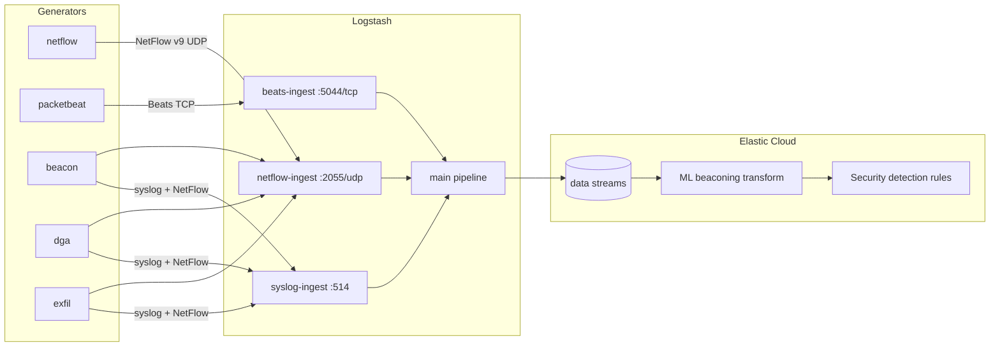

# Elastic Demos — Logstash, NetFlow, Network Traffic, and Security Use Cases

Synthetic data generators and a Logstash pipeline that ingest demo traffic into Elastic Cloud. Use this repo to populate NetFlow dashboards, Network Traffic analytics, and Elastic Security detection rules for C2 beaconing, DGA, and data exfiltration.

## Architecture

All generators send data to **Logstash** on a shared Docker network. Logstash normalizes events and writes them to Elastic data streams.



| Component | Input to Logstash | Primary Elastic destination |
|-----------|-------------------|----------------------------|
| [netflow/](#netflow-generator) | UDP 2055 (NetFlow v9) | `logs-netflow.log-default` |
| [packetbeat/](#network-traffic-packetbeat) | TCP 5044 (Beats) | `logs-network_traffic.*-default` |
| [beacon/](#beacon-c2-beaconing) | Syslog + NetFlow | `logs-network_traffic.flow-default` → ML transform `ml_beaconing.all` |
| [dga/](#dga-domain-generation-algorithm) | Syslog + NetFlow | `logs-dga.dns-default`, `logs-dga.alert-default` |
| [exfil/](#exfil-data-exfiltration) | Syslog + NetFlow | `logs-exfil.transfer-default`, `logs-endpoint.events.process-default` |

## Prerequisites

- Docker (with Compose v2)
- An Elastic Cloud deployment with ingest pipelines for the integrations you use
- API keys:
  - **Ingest key** (`ELASTIC_API_KEY`) — used by Logstash to write data streams
  - **Admin key** (`ELASTIC_ADMIN_API_KEY`) — used by enable-rule scripts to install/enable detection rules in Kibana

## Shared Docker network

Generators resolve Logstash by container name (`logstash`) on the external `demos` network:

```bash
docker network create demos
```

## Quick start

### 1. Configure and start Logstash

```bash
cd logstash
cp .env.example .env
# Edit ELASTIC_HOSTS and ELASTIC_API_KEY

docker compose build
docker compose up -d
```

Logstash exposes:

| Port | Protocol | Purpose |
|------|----------|---------|
| 2055 | UDP | NetFlow v9 / IPFIX |
| 5044 | TCP | Elastic Beats (Packetbeat) |
| 514 | UDP/TCP | Syslog |

Each input has its own ingest pipeline with a **persistent queue** (256 MB). The main processing pipeline uses a 1 GB queue. Queues survive container restarts via the `logstash-queue` volume.

### 2. Start generators

```bash
# Baseline NetFlow (NetFlow integration dashboards)
cd netflow && docker build -t demos-netflow . && docker run --rm --network demos --env-file .env demos-netflow

# Live protocol traffic (Network Traffic dashboards)
cd packetbeat && docker build -t demos-packetbeat . && docker run --rm --network demos --env-file .env demos-packetbeat

# Security use cases
cd security_use_cases/beacon && cp .env.example .env && docker compose up -d --build
cd security_use_cases/dga    && cp .env.example .env && docker compose up -d --build
cd security_use_cases/exfil  && cp .env.example .env && docker compose up -d --build
```

If Logstash was started before the `demos` network existed, attach it:

```bash
./security_use_cases/exfil/connect-logstash.sh
```

### 3. Enable detection rules (optional)

Each security demo includes a script to install prebuilt Elastic Security rules. Copy `.env.example` to `.env` and set `ELASTIC_HOSTS`, `ELASTIC_API_KEY`, and `ELASTIC_ADMIN_API_KEY`. Credentials load from the use-case `.env`, with `logstash/.env` as fallback (`security_use_cases/elastic_env.py`).

```bash
cd security_use_cases/beacon && ./enable-beacon-rules.sh
cd security_use_cases/dga    && ./enable-dga-rules.sh
cd security_use_cases/exfil  && ./enable-exfil-rules.sh
```

For beaconing, restart the ML transform after enough flow history is indexed:

```bash
cd security_use_cases/beacon && python3 trigger-beacon-transform.py
```

---

## Logstash

**Path:** `logstash/`

Central ingestion hub. Four pipelines (`config/pipelines.yml`):

| Pipeline | Config | Role |
|----------|--------|------|
| `main` | `pipeline/main.conf` | Filtering, ECS mapping, Elasticsearch output |
| `netflow-ingest` | `pipeline/netflow-ingest.conf` | UDP 2055 → `main` |
| `beats-ingest` | `pipeline/beats-ingest.conf` | TCP 5044 → `main` |
| `syslog-ingest` | `pipeline/syslog-ingest.conf` | UDP/TCP 514 → `main` |

The main pipeline enriches NetFlow records for the NetFlow integration, parses JSON syslog from demo programs (`beacon-demo`, `dga-demo`, `exfil-demo`, `endpoint-process-demo`), and routes events to the correct data stream.

**Configuration**

| Variable | Description |
|----------|-------------|
| `ELASTIC_HOSTS` | Elasticsearch HTTPS endpoint |
| `ELASTIC_API_KEY` | Ingest API key (`id:secret` format) |
| `LOGSTASH_IMAGE` | Docker image name (default `demos-logstash`) |
| `LOGSTASH_CONTAINER_NAME` | Container name (default `logstash`) |

```bash
cd logstash
docker compose up -d --build
docker logs -f logstash
```

---

## NetFlow generator

**Path:** `netflow/`

Sends synthetic **NetFlow v9** datagrams over UDP. Each packet includes a template flowset and multiple flow records covering common traffic patterns (HTTP, HTTPS, DNS, SSH, SNMP, MySQL, NTP, ICMP).

| Variable | Default | Description |
|----------|---------|-------------|
| `NETFLOW_TARGET` | `172.17.0.2` | Logstash host (`logstash` on `demos` network) |
| `NETFLOW_PORT` | `2055` | NetFlow UDP port |
| `NETFLOW_INTERVAL` | `1` | Seconds between datagrams |
| `NETFLOW_FLOWS_PER_PACKET` | `8` | Flow records per datagram |

```bash
cd netflow
cp .env.example .env
docker build -t demos-netflow .
docker run --rm --network demos --env-file .env demos-netflow
```

**Elastic output:** `logs-netflow.log-default`

---

## Network traffic (Packetbeat)

**Path:** `packetbeat/`

Runs **Packetbeat** plus local services (nginx, DNS, databases, message queues, etc.) and a traffic generator. Packetbeat captures real protocol conversations and ships ECS events to Logstash over Beats (TCP 5044).

Logstash maps Packetbeat events to `logs-network_traffic.*-default` data streams (flow, dns, http, tls, and other protocol datasets).

| Variable | Default | Description |
|----------|---------|-------------|
| `LOGSTASH_HOST` | `172.17.0.2` | Logstash host (`logstash` on `demos` network) |
| `LOGSTASH_PORT` | `5044` | Beats input port |
| `TRAFFIC_INTERVAL` | `5` | Seconds between generated traffic bursts |

```bash
cd packetbeat
cp .env.example .env
docker build -t demos-packetbeat .
docker run --rm --network demos --env-file .env demos-packetbeat
```

**Elastic output:** `logs-network_traffic.*-default`

---

## Security use case generators

**Path:** `security_use_cases/`

Three Dockerized simulators that emit syslog JSON, NetFlow, and Snort-style alerts to trigger Elastic Security prebuilt rules.

### Beacon (C2 beaconing)

**Path:** `security_use_cases/beacon/`

Simulates infected hosts (`10.0.50.0/24`) sending periodic TCP connections to C2 destinations. Emits ECS flow events, NetFlow records, and Snort alerts. Backfills several hours of flow history on startup for the Network Beaconing ML transform.

| Variable | Default | Description |
|----------|---------|-------------|
| `BEACON_OUTPUT_MODE` | `all` | `all`, `flow`, `netflow`, or `snort` |
| `BEACON_SYSLOG_TARGET` | `logstash` | Syslog destination |
| `BEACON_NETFLOW_TARGET` | `logstash` | NetFlow destination |
| `BEACON_HOSTS` | `3` | Number of infected hosts |
| `BEACON_INTERVALS` | `60,120,300` | Beacon period choices (seconds) |
| `BEACON_BACKFILL_HOURS` | `6` | Historical flow backfill on startup |

**Rules:** Statistical Model Detected C2 Beaconing Activity (queries `ml_beaconing.all`)

```bash
cd security_use_cases/beacon
cp .env.example .env
docker compose up -d --build
./enable-beacon-rules.sh
python3 trigger-beacon-transform.py
```

### DGA (domain generation algorithm)

**Path:** `security_use_cases/dga/`

Simulates DNS queries mixing benign domains with algorithmically generated DGA domains.

| Variable | Default | Description |
|----------|---------|-------------|
| `DGA_OUTPUT_MODE` | `all` | `all`, `dns`, `netflow`, or `snort` |
| `DGA_INTERVAL` | `3` | Seconds between query bursts |
| `DGA_RATIO` | `0.7` | Fraction of DGA vs benign queries |
| `DGA_NXDOMAIN_RATIO` | `0.92` | Fraction of DGA queries that get NXDOMAIN |
| `DGA_ALGORITHM` | _(random)_ | Pin one algorithm or leave empty |

**Rules:** Potential DGA Activity (ML)

```bash
cd security_use_cases/dga
cp .env.example .env
docker compose up -d --build
./enable-dga-rules.sh
```

### Exfil (data exfiltration)

**Path:** `security_use_cases/exfil/`

Runs real **`curl`** and **`wget`** commands to upload synthetic sensitive files to a local HTTP receiver. Reports via syslog, synthetic endpoint process events, NetFlow, and Snort alerts.

| Variable | Default | Description |
|----------|---------|-------------|
| `EXFIL_OUTPUT_MODE` | `all` | `all`, `flow`, `netflow`, `snort`, or `process` |
| `EXFIL_TOOLS` | `curl,wget` | Tools to simulate |
| `EXFIL_INTERVAL` | `15` | Seconds between exfil attempts |
| `EXFIL_RECEIVER_URL` | `http://127.0.0.1:8888/upload` | Local upload endpoint |

**Rules:** Potential Data Exfiltration Through Curl / Wget

```bash
cd security_use_cases/exfil
cp .env.example .env
docker compose up -d --build
./enable-exfil-rules.sh
```

---

## Troubleshooting

**Generators cannot reach Logstash** — Confirm Logstash is on the `demos` network and use `logstash` as the target hostname. Run `connect-logstash.sh` if needed.

**No documents in Elasticsearch** — Check `docker logs logstash` and verify `ELASTIC_HOSTS` / `ELASTIC_API_KEY` in `logstash/.env`.

**Beacon rules not firing** — Rules depend on the ML transform (`ml_beaconing.all`). Run `trigger-beacon-transform.py` after backfill completes.

**Wget exfil rule not firing** — The rule queries `logs-endpoint.events.process-*`. Keep `EXFIL_OUTPUT_MODE=all` so synthetic process events are emitted.

## Repository layout

```
demos/
├── logstash/                 # Logstash image, pipelines, compose
├── netflow/                  # NetFlow v9 generator
├── packetbeat/               # Packetbeat + traffic generator (network_traffic)
├── security_use_cases/
│   ├── elastic_env.py        # Shared .env loader for rule scripts
│   ├── beacon/               # C2 beaconing demo
│   ├── dga/                  # DGA DNS demo
│   └── exfil/                # curl/wget exfil demo
└── snort/                    # Standalone Snort alert generator (optional)
```
