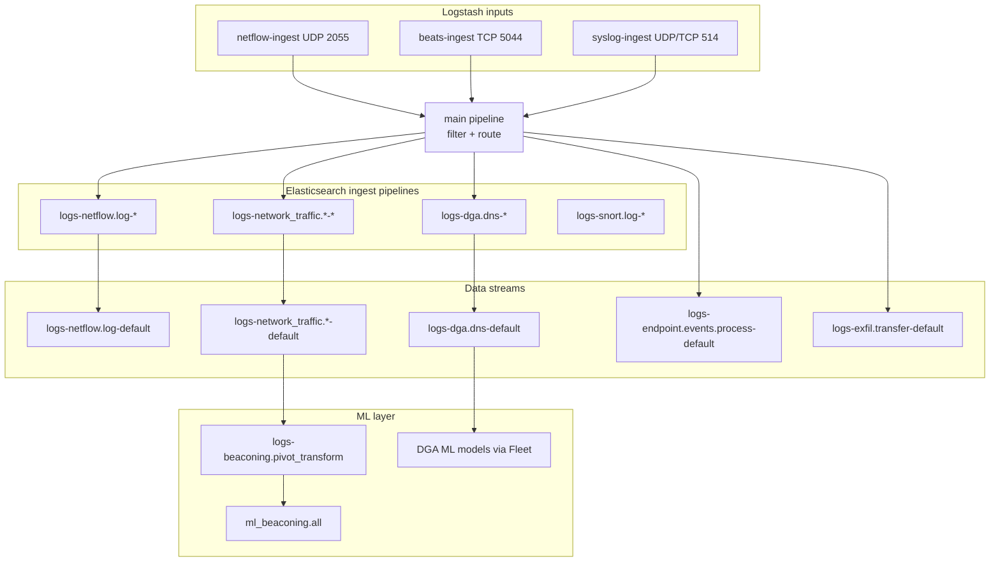

# Ingest Pipelines, Field Mappings, ML Jobs & Transforms

Reference for the Elastic Demos stack: Logstash routing, Elasticsearch ingest pipelines, ECS field mappings, ML transforms, and detection-rule query targets.

> **Version note:** Pipeline IDs in `logstash/pipeline/main.conf` include integration version suffixes (e.g. `-1.34.2`, `-2.25.1-klg`). These must match pipelines installed in your Elastic deployment. Update `main.conf` if your Fleet integration versions differ.

---

## Table of contents

1. [Pipeline architecture](#pipeline-architecture)
2. [Logstash pipelines](#logstash-pipelines)
3. [Elasticsearch ingest pipelines](#elasticsearch-ingest-pipelines)
4. [Data stream routing](#data-stream-routing)
5. [Field mappings](#field-mappings)
6. [Generator source schemas](#generator-source-schemas)
7. [ML transforms and jobs](#ml-transforms-and-jobs)
8. [Detection rules and query indices](#detection-rules-and-query-indices)

---

## Pipeline architecture



---

## Logstash pipelines

Configured in `logstash/config/pipelines.yml`. Each ingest pipeline has its own **persistent queue** (256 MB). `main` uses a 1 GB queue.

| Pipeline ID | Config file | Input | Output |
|-------------|-------------|-------|--------|
| `main` | `pipeline/main.conf` | `pipeline { address => "main" }` | Elasticsearch (routed by tags/type) |
| `netflow-ingest` | `pipeline/netflow-ingest.conf` | UDP 2055, NetFlow v9 codec | `pipeline { send_to => ["main"] }` |
| `beats-ingest` | `pipeline/beats-ingest.conf` | TCP 5044, Beats input | `pipeline { send_to => ["main"] }` |
| `syslog-ingest` | `pipeline/syslog-ingest.conf` | UDP/TCP 514, syslog input | `pipeline { send_to => ["main"] }` |

### netflow-ingest

| Setting | Value |
|---------|-------|
| Port | UDP 2055 |
| Codec | `netflow { versions => [9] }` |
| Tags | `netflow` |
| Type | `netflow` |
| Workers | 4 |
| Receive buffer | 16 MB |

### beats-ingest

| Setting | Value |
|---------|-------|
| Port | TCP 5044 |
| Tags | `beats` |
| Source | Packetbeat (`agent.type: packetbeat`) |

### syslog-ingest

| Setting | Value |
|---------|-------|
| Port | UDP/TCP 514 |
| Tags | `syslog` |
| Source | Security use-case generators, Snort alerts |

---

## Elasticsearch ingest pipelines

Applied at index time via the Logstash `elasticsearch` output `pipeline` parameter.

| Trigger condition (Logstash) | Data stream | Elasticsearch ingest pipeline |
|-----------------------------|-------------|------------------------------|
| `netflow` tag / `netflow` type / `[netflow][version]` | `logs-netflow.log-default` | `logs-netflow.log-2.25.1-klg` |
| `beats` + `agent.type == packetbeat` | `logs-network_traffic.<protocol>-default` | `logs-%{[data_stream][dataset]}-1.34.2` (dynamic) |
| `beacon` + `c2` tags | `logs-network_traffic.flow-default` | `logs-network_traffic.flow-1.34.2` |
| `dga` + `dns` tags | `logs-dga.dns-default` | `logs-dga.dns-1.0.0` |
| `snort` tag | `logs-snort.log-default` | `logs-snort.log-1.21.2` |
| `endpoint_process` tag | `logs-endpoint.events.process-default` | _(none — direct write)_ |
| `exfil` + `data_loss` tags | `logs-exfil.transfer-default` | _(none — direct write)_ |
| `dga` + `snort` tags | `logs-dga.alert-default` | _(none — direct write)_ |
| Default (unmatched syslog) | `logs-syslog-default` | _(none — direct write)_ |

### Dynamic Packetbeat pipelines

Packetbeat events are assigned a `data_stream.dataset` in `main.conf`, then routed to:

```
logs-<data_stream.dataset>-1.34.2
```

Common datasets from the Packetbeat demo (`packetbeat/packetbeat.yml.template`):

| Protocol | Typical `data_stream.dataset` |
|----------|--------------------------------|
| ICMP | `network_traffic.icmp` |
| DHCP | `network_traffic.dhcpv4` |
| DNS | `network_traffic.dns` |
| HTTP | `network_traffic.http` |
| AMQP | `network_traffic.amqp` |
| Cassandra | `network_traffic.cassandra` |
| MySQL | `network_traffic.mysql` |
| PostgreSQL | `network_traffic.pgsql` |
| Redis | `network_traffic.redis` |
| Thrift | `network_traffic.thrift` |
| MongoDB | `network_traffic.mongodb` |
| Memcache | `network_traffic.memcached` |
| NFS | `network_traffic.nfs` |
| TLS | `network_traffic.tls` |
| SIP | `network_traffic.sip` |
| _(fallback)_ | `network_traffic.flow` |

The DNS ingest pipeline (`logs-network_traffic.dns-1.34.2`) includes the Fleet **`ml_dga_ingest_pipeline`** processor for DGA ML scoring on live DNS traffic from Packetbeat.

---

## Data stream routing

Summary of all destinations from `logstash/pipeline/main.conf`:

| Data stream | Type | Namespace | Source generator(s) | Logstash tags / trigger |
|-------------|------|-----------|---------------------|-------------------------|
| `logs-netflow.log-default` | logs | default | `netflow/`, all security generators (NetFlow mode) | `netflow` |
| `logs-network_traffic.*-default` | logs | default | `packetbeat/` | `beats`, `agent.type: packetbeat` |
| `logs-network_traffic.flow-default` | logs | default | `security_use_cases/beacon/` | `beacon`, `c2` |
| `logs-dga.dns-default` | logs | default | `security_use_cases/dga/` | `dga`, `dns` |
| `logs-dga.alert-default` | logs | default | `security_use_cases/dga/` (Snort format) | `dga`, `snort` |
| `logs-exfil.transfer-default` | logs | default | `security_use_cases/exfil/` | `exfil`, `data_loss` |
| `logs-endpoint.events.process-default` | logs | default | `security_use_cases/exfil/` | `endpoint_process` |
| `logs-snort.log-default` | logs | default | beacon, dga, exfil, `snort/` | `snort` |
| `logs-syslog-default` | logs | default | Unmatched syslog | default output |

---

## Field mappings

### Global (all events)

Applied in `main.conf` when `event.ingested` is absent:

| Target field | Source / logic |
|--------------|----------------|
| `event.ingested` | Current UTC timestamp (ISO8601 ms) — required for detection rules using `timestamp_override: event.ingested` |

### NetFlow events

Triggered when `[netflow]` is present (NetFlow codec output).

| Target field | Source / logic |
|--------------|----------------|
| `tags` | Add `netflow` |
| `netflow.src_tos` | Copy from `netflow.dst_tos` (if missing) |
| `netflow.ip_class_of_service` | Copy from `netflow.dst_tos` or `netflow.src_tos` |
| `netflow.tcp_control_bits` | Copy from `netflow.tcp_flags` |
| `netflow.dst_mask` | Default `0` |
| `netflow.src_mask` | Default `0` |
| `netflow.direction` | Default `0` |
| `netflow.ingress_interface` | Copy from `netflow.input_snmp` |
| `netflow.egress_interface` | Copy from `netflow.output_snmp` |
| `agent.name` | `netflow-demo-exporter` |
| `agent.type` | `logstash` |
| `observer.ip` | `10.0.0.1` |
| `netflow.exporter.address` | `10.0.0.1:2055` |
| `netflow.exporter.version` | Copy from `netflow.version` |

#### NetFlow v9 template (generators)

All generators use template ID **256** with these information elements:

| IE ID | Length | Field name |
|-------|--------|------------|
| 8 | 4 | IPV4_SRC_ADDR |
| 12 | 4 | IPV4_DST_ADDR |
| 4 | 1 | PROTOCOL |
| 7 | 2 | L4_SRC_PORT |
| 11 | 2 | L4_DST_PORT |
| 6 | 1 | TCP_FLAGS |
| 1 | 4 | IN_BYTES |
| 2 | 4 | IN_PKTS |
| 10 | 4 | INPUT_SNMPINT |
| 14 | 4 | OUTPUT_SNMPINT |
| 55 | 1 | DST_TOS |
| 58 | 2 | SRC_VLAN |
| 59 | 2 | DST_VLAN |
| 21 | 4 | LAST_SWITCHED _(netflow/ only)_ |
| 22 | 4 | FIRST_SWITCHED _(netflow/ only)_ |

The Logstash NetFlow codec decodes these into `[netflow][*]` fields before the enrichments above.

### Syslog program routing

Logstash 8 syslog input stores the program name in `[process][name]`. When `[program]` is missing:

| Target | Source |
|--------|--------|
| `program` | `[process][name]` |

| `program` value | JSON parse target | Result tags | Data stream dataset |
|-----------------|-------------------|-------------|---------------------|
| `endpoint-process-demo` | `process_event` → flatten to root | `endpoint_process` | `endpoint.events.process` |
| `exfil-demo` | `exfil_event` → rename fields | `exfil`, `data_loss` | `exfil.transfer` |
| `beacon-demo` | `beacon_event` → rename fields | `beacon`, `c2` | `network_traffic.flow` |
| `dga-demo` (JSON) | `dga_event` → rename fields | `dga`, `dns` | `dga.dns` |
| `dga-demo` (Snort `[sid:gid:rev]`) | — | `dga`, `snort` | `dga.alert` |
| `snort` or Snort-format message | — | `snort` | `snort.log` |

#### endpoint-process-demo field promotion

JSON fields from `process_event` are flattened to the event root (all keys except `@timestamp`). Then:

| Field | Value |
|-------|-------|
| `data_stream.type` | `logs` |
| `data_stream.dataset` | `endpoint.events.process` |
| `data_stream.namespace` | `default` |

#### exfil-demo field renames

| Source (`exfil_event.*`) | Target |
|--------------------------|--------|
| `event` | `event` |
| `tags` | `tags` |
| `network` | `network` |
| `source` | `source` |
| `destination` | `destination` |
| `file` | `file` |
| `http` | `http` |
| `url` | `url` |
| `exfil` | `exfil` |

#### beacon-demo field renames

| Source (`beacon_event.*`) | Target |
|---------------------------|--------|
| `event` | `event` |
| `tags` | `tags` |
| `host` | `host` |
| `process` | `process` |
| `network` | `network` |
| `source` | `source` |
| `destination` | `destination` |
| `beacon` | `beacon` |

#### dga-demo field renames

| Source (`dga_event.*`) | Target |
|------------------------|--------|
| `event` | `event` |
| `tags` | `tags` |
| `network` | `network` |
| `source` | `source` |
| `destination` | `destination` |
| `dns` | `dns` |
| `dga` | `dga` |

### Packetbeat events

Triggered when `beats` in tags and `agent.type == packetbeat`.

#### Data stream dataset assignment

| Condition | `data_stream.dataset` |
|-----------|----------------------|
| `event.dataset` matches `network_traffic.*` | Copy `event.dataset` as-is |
| `event.dataset` present | `network_traffic.<event.dataset>` |
| `type` present | `network_traffic.<type>` |
| Fallback | `network_traffic.flow` |

Always set: `data_stream.type = logs`, `data_stream.namespace = default`.

#### Dashboard status field

| Condition | `status` value |
|-----------|----------------|
| `http.response.status_code >= 500` | `Server Error` |
| `http.response.status_code >= 400` | `Client Error` |
| HTTP present, no status | `OK` |
| `dns.response_code != NOERROR` | `Client Error` |
| Otherwise (no status) | `OK` |

#### GeoIP enrichment

GeoIP applied (ECS disabled) for: `client.ip`, `server.ip`, `source.ip`, `destination.ip`.

Fallback geo for unresolved private/loopback IPs (Ruby filter):

| IP range | Geo assigned |
|----------|--------------|
| `127.0.0.1`, `::1`, RFC1918 | San Francisco, CA, US (37.7749, -122.4194) |
| `1.1.1.1` | Australia (Cloudflare resolver) |

---

## Generator source schemas

Fields emitted by generators **before** Logstash processing.

### netflow/generate.py

Synthetic exporter traffic only — no syslog. Patterns: HTTP, HTTPS, DNS, SSH, SNMP, MySQL, NTP, ICMP.

| Field (post-codec) | Example / notes |
|--------------------|-----------------|
| `netflow.ipv4_src_addr` | `10.0.1.x` |
| `netflow.ipv4_dst_addr` | Public or internal dest |
| `netflow.protocol` | 6 (TCP), 17 (UDP), 1 (ICMP) |
| `netflow.l4_src_port` | Ephemeral |
| `netflow.l4_dst_port` | 80, 443, 53, 22, etc. |
| `netflow.tcp_flags` | e.g. `0x18` (PSH+ACK) |
| `netflow.in_bytes` / `in_pkts` | Random per flow |
| `netflow.src_vlan` / `dst_vlan` | 100, 200, 300, 400 |

### security_use_cases/beacon/generate.py

Syslog program: `beacon-demo`. Key ECS fields for ML transform input:

| Field | Value / notes |
|-------|---------------|
| `event.action` | **`disconnect_received`** (required by beaconing transform) |
| `event.type` | `["end"]` |
| `event.category` | `["network"]` |
| `event.dataset` | `network_traffic.flow` |
| `host.name` | `infected-host-<octet>` |
| `process.name` | `beaconloader` |
| `process.pid` | **Stable per host/C2 pair** (required for transform grouping) |
| `source.ip` / `destination.ip` | `10.0.50.x` → public C2 |
| `source.bytes` / `destination.bytes` | Split from total octets |
| `beacon.interval_seconds` | 60, 120, 300, or 600 |
| `beacon.suspicious` | `true` |

C2 prefixes used: `185.220.101.`, `45.33.32.`, `104.244.42.`, `91.219.236.` (RFC 5737 / bogon ranges excluded).

### security_use_cases/dga/generate.py

Syslog program: `dga-demo`.

| Field | Value / notes |
|-------|---------------|
| `event.action` | `dns_query` |
| `event.dataset` | `dga.dns` |
| `dns.question.name` | Generated or benign domain |
| `dns.question.type` | `A` |
| `dns.response_code` | `NOERROR` or `NXDOMAIN` |
| `dns.type` | `query` |
| `dga.algorithm` | `random`, `consonant_vowel`, `wordlist`, `time_seeded`, `hex_seed`, or `none` |
| `dga.suspicious` | `true` for DGA domains |
| `tags` | `dga`, `dns`, `<algorithm>` or `dns`, `benign` |

### security_use_cases/exfil/generate.py

Syslog programs: `exfil-demo` (flow), `endpoint-process-demo` (process).

#### exfil-demo flow event

| Field | Value / notes |
|-------|---------------|
| `event.action` | `data_exfiltration` |
| `event.dataset` | `exfil.transfer` |
| `exfil.tool` | `curl` or `wget` |
| `exfil.sensitive_data_type` | `credentials`, `pii`, `source_code`, etc. |
| `file.name` / `file.size` | Synthetic sensitive filename |
| `url.full` | External exfil URL (not localhost) |
| `destination.domain` | e.g. `paste.evil-cdn.net` |

#### endpoint-process-demo event

| Field | Value / notes |
|-------|---------------|
| `event.action` | **`exec`** |
| `event.type` | `start` |
| `event.dataset` | `endpoint.events.process` |
| `process.name` | `curl` or `wget` |
| `process.args` | Full argv including `--data-binary @...` or `--post-file` |
| `process.command_line` | Shell-quoted argv |
| `agent.type` | `endpoint` |

Process events report the **external** exfil URL in args (not `127.0.0.1`) so prebuilt wget/curl rules match.

---

## ML transforms and jobs

### Network Beaconing (C2)

| Property | Value |
|----------|-------|
| **Transform ID** | `logs-beaconing.pivot_transform-default-1.6.0` |
| **Source index** | `logs-network_traffic.flow-default` (and compatible flow indices) |
| **Destination index** | `ml_beaconing.all` |
| **Trigger script** | `security_use_cases/beacon/trigger-beacon-transform.py` |
| **Key output field** | `beacon_stats.is_beaconing` (boolean) |

#### Transform input requirements

The beacon generator produces flow events shaped for the Network Beaconing integration:

| Required field | Expected value |
|----------------|----------------|
| `event.action` | `disconnect_received` |
| `event.type` | includes `end` |
| `source.bytes` / `destination.bytes` | Present, non-zero |
| `host.name` | Stable hostname per source host |
| `process.pid` | Stable per beacon profile (do not randomize per event) |
| `@timestamp` | Periodic intervals with low jitter |

#### Operational steps

1. Index ≥ 6 hours of flow data (`BEACON_BACKFILL_HOURS=6` on generator startup).
2. Run `python3 trigger-beacon-transform.py` to stop/start the transform.
3. Verify: `POST /ml_beaconing.all/_count` with `{"query":{"term":{"beacon_stats.is_beaconing":true}}}`.

### DGA (Domain Generation Algorithm)

DGA detection uses **Fleet-installed ML models** rather than a demo-managed transform.

| Component | Details |
|-----------|---------|
| **Ingest enrichment** | `ml_dga_ingest_pipeline` inside `logs-network_traffic.dns-1.34.2` (Packetbeat DNS) and `logs-dga.dns-1.0.0` (demo DNS events) |
| **Source data** | `logs-dga.dns-default` from DGA generator; `logs-network_traffic.dns-default` from Packetbeat |
| **ML output fields** | Scored by Fleet DGA model (e.g. `ml_is_dga.malicious_prediction`, probability fields — exact names depend on integration version) |
| **Demo script** | `security_use_cases/dga/enable-dga-rules.py` adds `logs-dga.dns-*` to rule index patterns |

No transform ID is hardcoded in this repo for DGA; scoring is handled by the installed DGA integration ingest pipelines.

### Exfiltration

Exfil detection rules are **query-based** (not ML). They query:

| Rule | Query index |
|------|-------------|
| Potential Data Exfiltration Through Curl | `logs-endpoint.events.process-*` |
| Potential Data Exfiltration Through Wget | `logs-endpoint.events.process-*` |

Key query fields: `process.name`, `event.action: exec`, `process.args` containing `--data-binary` (curl) or `--post-file` (wget).

---

## Detection rules and query indices

Prebuilt Elastic Security rules installed/enabled by the demo scripts.

### Beacon (`enable-beacon-rules.py`)

| Rule ID | Rule name | Query index |
|---------|-----------|-------------|
| `5397080f-34e5-449b-8e9c-4c8083d7ccc6` | Statistical Model Detected C2 Beaconing Activity | `ml_beaconing.all` |
| `0ab319ef-92b8-4c7f-989b-5de93c852e93` | Statistical Model Detected C2 Beaconing Activity with High Confidence | `ml_beaconing.all` |

Tag filter: **Use Case: C2 Beaconing Detection**

### DGA (`enable-dga-rules.py`)

| Rule ID | Rule name | Type |
|---------|-----------|------|
| `ff0d807d-869b-4a0d-a493-52bc46d2f1b1` | Potential DGA Activity (ML) | ML |
| `da7f5803-1cd4-42fd-a890-0173ae80ac69` | High DGA probability score | Query |
| `f3403393-1fd9-4686-8f6e-596c58bc00b4` | Predicted DGA domain | Query |
| `bcaa15ce-2d41-44d7-a322-918f9db77766` | SUNBURST DNS domain | Query |

Index pattern patch: adds **`logs-dga.dns-*`** to query-rule index lists.

Tag filter: **Use Case: Domain Generation Algorithm Detection**

### Exfil (`enable-exfil-rules.py`)

| Rule ID | Rule name | Query index |
|---------|-----------|-------------|
| `be70614d-4295-473c-a953-582aef41c865` | Potential Data Exfiltration Through Curl | `logs-endpoint.events.process-*` |
| `8d8c0b55-ef27-4c20-959f-fa8dd3ac25e6` | Potential Data Exfiltration Through Wget | `logs-endpoint.events.process-*` |

---

## Quick reference: end-to-end paths

| Demo | Generator path | Logstash input | ES ingest pipeline | Data stream | ML / rules |
|------|----------------|----------------|-------------------|-------------|------------|
| NetFlow dashboards | `netflow/` | UDP 2055 | `logs-netflow.log-2.25.1-klg` | `logs-netflow.log-default` | — |
| Network Traffic dashboards | `packetbeat/` | TCP 5044 | `logs-network_traffic.<proto>-1.34.2` | `logs-network_traffic.*-default` | DGA ML on DNS |
| C2 beaconing | `security_use_cases/beacon/` | Syslog 514 | `logs-network_traffic.flow-1.34.2` | `logs-network_traffic.flow-default` | Transform → `ml_beaconing.all` → rules |
| DGA | `security_use_cases/dga/` | Syslog 514 | `logs-dga.dns-1.0.0` | `logs-dga.dns-default` | DGA ML ingest pipeline → rules |
| Data exfil | `security_use_cases/exfil/` | Syslog 514 | _(none)_ | `logs-exfil.transfer-default`, `logs-endpoint.events.process-default` | Query rules |

---

## Related files

| File | Purpose |
|------|---------|
| `logstash/pipeline/main.conf` | All field mappings and ES routing |
| `logstash/config/pipelines.yml` | Logstash pipeline definitions |
| `logstash/pipeline/netflow-ingest.conf` | NetFlow input |
| `logstash/pipeline/beats-ingest.conf` | Beats input |
| `logstash/pipeline/syslog-ingest.conf` | Syslog input |
| `security_use_cases/beacon/trigger-beacon-transform.py` | ML transform control |
| `security_use_cases/*/enable-*-rules.py` | Detection rule installation |
| `scripts/export-elastic-artifacts.py` | Export ingest pipelines, transforms, ML jobs to JSON |
| `artifacts/elastic-demo-artifacts.zip` | Downloadable bundle of all exported artifacts |
| `artifacts/README.md` | Artifact index and import examples |

---

*Generated for the Elastic Demos repository. Last updated to match `main.conf` and generator schemas in this workspace.*
